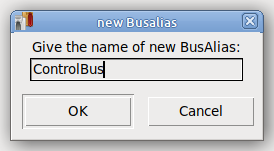

# KiCadEditBusAliases
Simple tool for easy edit of Bus Aliases across hierarchical sheets.

It is easy, because of
* edit bus member names within a text-box (text-editor-like)
* assign/remove Bus Aliases to/from sheet by tick/untick a checkbox

## Installation
* install python3
* install kiutils
  ```
  pip3 install kiutils
  ```
Copy KiCadEditBusAliases.py to a directory, your PATH-variable points to.

## Usage
* Close your KiCad project.
* Pass root schematic file of your KiCad project as a parameter for the script.
  ```
  KiCadEditBusAliases.py <eeschema_file_name.kicad_sch>
  ```
* Do the changes you want (see pictures below). Don't forget to assign each and every Bus Alias to at least one file. Otherwise it will _not_ be saved.
* Press "save and exit" to make changes permanent to *.kicad_sch files.
* Open your KiCad project and continue editing using eeschema.

## Screen shots
 Main window

 Window to edit members of a Bus Alias

 Insert a new Bus Alias


